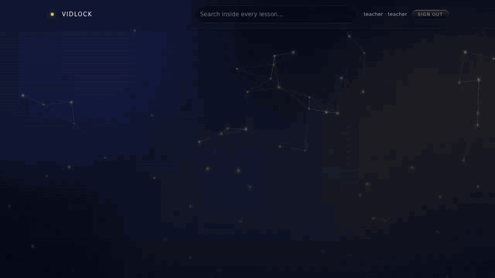

# vidlock demo

A small course site that uses django-vidlock: sign in, watch a sealed lesson,
see who watched it. Everything runs on your machine — no bucket, no Redis, no
Docker. You need Python 3.10+ and `ffmpeg`.

```bash
cd example
python -m venv .venv && . .venv/bin/activate
pip install -e ..
python manage.py migrate
python manage.py demo        # accounts + a sealed 2½-minute sample lesson
python manage.py runserver
```

Open http://127.0.0.1:8000/ and sign in as **student / demo** to watch, or
**teacher / demo** to upload lessons and see who watched them.

Things to try:

* **DevTools → Network.** The `key?…&k=1` requests return a sealed blob, not
  a key. Copying one into a downloader gets nothing.
* **Open the lesson in a second browser** as the same student. The first one
  stops: "This account is watching on another device".
* **Fullscreen.** The watermark (name, code, time) stays, and a faint copy
  covers the frame.
* **Watch part of it, then open "who watched"** as the teacher: completion,
  where each student stopped, and a heatmap of the parts played most.
* `python manage.py vidlock_doctor --offline` checks the setup.

The demo keeps videos in `example/media/` and serves them through Django
(`vidlock.contrib.devstorage`), which only works with `DEBUG = True`. A real
site uses an S3-compatible bucket such as Cloudflare R2; see the main README.



The demo's look (palette, glass cards, the spinning-border button and the
constellation background in `lessons/static/lessons/`) is adapted from
[ThreeUI](https://github.com/MengTo/threeui) by Meng To, MIT licensed.
